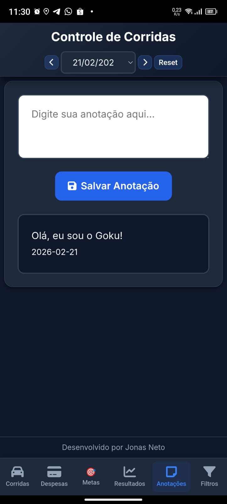

# Controle-Do-Motoca
Dashboard de gestão financeira para motoboys multi-app (Uber, 99, iFood, Particular).

🏍️ **Controle Do Motoca - Versão 2.0**

Do asfalto ao código: Uma solução real para um problema de 3 anos.

**📖 A Minha História**
Trabalho nas ruas há 3 anos como entregador. Quem vive o dia a dia de motoboy sabe que a gestão financeira é um dos maiores desafios da profissão. Eu operava em um malabarismo exaustivo entre **Uber, 99, iFood, Voa Delivery e corridas Particulares**.

Minha meta era simples, mas cruel de alcançar: **R$ 100,00 líquidos por dia**, após descontar os **R$ 20,00** de gasolina. Mas a realidade era uma "catástrofe". Eu me perdia nos cálculos, esquecia de anotar os ganhos por fora e chegava no fim do mês sem saber se estava lucrando ou apenas pagando para trabalhar. Olhei na Play Store e não vi nada que entendesse a minha dor. Foi ali que decidi: eu mesmo ia construir minha solução, **mesmo sem saber absolutamente nada de programação**.

**🛠️ O Desafio Técnico e a Persistência**
O início foi solitário e brutal. Comecei no **ChatGPT** usando apenas **linguagem natural**, tentando explicar para uma máquina o que eu ainda não entendia tecnicamente.

A Luta contra o **"Código Monstro"**: Sem saber sobre arquitetura, eu mantinha tudo **(HTML, CSS, JS)** em um único arquivo gigantesco que vivia quebrando sem parar.

**O Ciclo de Frustração**: Houve noites em que a raiva vencia. Eu xingava a tela **("MEU DEUS, FAZ ISSO DIREITO")**, revoltado com as respostas genéricas, e desisti várias vezes. Larguei o projeto de mão, convicto de que aquilo não era para mim.

**A Virada de Chave**: A necessidade me puxava de volta. Testei o **DeepSeek** como alternativa ao **ChatGPT** e ele me retornou o código com CSS, o que deu uma cara nova ao app. Mas o código continuava quebrando o tempo todo em um loop eterno de problemas. Foi aí que o **ChatGPT** me sugeriu **dividir o código em HTML, CSS e JS**. Esse foi o particionamento de arquivos que serviu como o divisor de águas, permitindo o projeto finalmente avançar sem quebrar a cada linha.

**📈 Evolução do Projeto**
**Versão 1.0 (O Marco Zero)**: Uma página simples de rolagem infinita. Mesmo rústica, já resolveu o problema real de 8 colegas motoboys que passaram a usar o app diariamente.

**Versão 2.0 (O Dashboard Profissional)**: Inspirado em apps de finanças, decidi mudar tudo para um **sistema de Abas, Menus e Cards**. Foi um desafio enorme de lógica e interface, onde precisei até encarar o **Android Studio** para gerar o APK funcional. Para estabilizar esta versão, precisei **sacrificar temporariamente algumas funções dinâmicas**, focando na solidez do que entrego hoje.

**🎯 Cicatrizes e o Futuro (Roadmap de Engenheiro**
Este projeto marca o fim da minha fase autodidata. No dia **23 de fevereiro de 2026**, inicio o curso **Jovem Programador**. Meu objetivo é utilizar as habilidades técnicas que vou adquirir para transformar esta solução em algo profissional, implementando o que eu ainda não conseguia dominar:

**Backup em Nuvem e Login**: Criar um sistema de autenticação e banco de dados online para que nenhum motoboy nunca mais perca seus dados ao formatar o celular, como aconteceu comigo 3 vezes.

**Inteligência Logística e KM**: Desenvolver módulos automáticos para cálculo de quilometragem e consumo real de combustível.

**Mapeamento de Entregas**: Implementar um mapa de locais visitados para facilitar a gestão das entregas particulares.

**Resgate das Lojas Dinâmicas**: Reconstruir a função de adicionar lojas que tive que sacrificar na versão 2.0 por limitações técnicas.

**Escalabilidade**: Preparar o app para que mais colegas possam utilizar a ferramenta com segurança e performance.

-----------------------------------------------------------------------------------------------------------------------------------------------

**📸 Demonstração e Visual do App**
Para comprovar a eficiência do sistema, veja abaixo o funcionamento das principais telas e uma demonstração em vídeo:

**🎬 Vídeo de Demonstração**

[Clique aqui para ver o Controle do Motoca em ação (YouTube Shorts)](https://www.youtube.com/shorts/V-oulVFKnu0)

**🖼️ Telas do Sistema**
Você pode organizar os seus prints em uma galeria para que o recrutador veja o cuidado que você teve com a UX (User Experience):

  
  
  

  
  
  

  

**Desenvolvido com persistência e rigor por Jonas Neto.**

